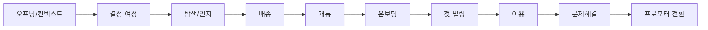

# 통신 3사 여정별 도식화 및 비교 분석

**작성일:** 2026년 3월 16일  
**분석 원천:**  
- `아이폰2030_통신경험_인터뷰_보고서_0313.md` (통신 경험 1·2)  
- `LG_Uplus_통신경험_분석_보고서.md` (통신 경험 1·2·3)  
- `아이폰2030_인터뷰_가이드라인_초안_0313_가이드라인_보완.md` (여정·질문 체계)  

**목적:**  
1) 여정별 도식화 정리  
2) 통신사(SKT·KT·LG U+)별 주요 특징, 차이점, 열위·우위 구분  

> **참고:** 60. 유저인사이트팀 **SKT 폴더**에는 피어리뷰(동료평가) 관련 자료만 있으며, 통신 3사·번호이동 여정 분석 원천은 **LG Uplus** 폴더의 통신경험 인터뷰·보고서입니다.

---

## 1. 여정별 도식화

### 1.1 여정 단계 정의 (가이드라인 기준)

| 단계  | 여정 이름    | 핵심 질문 영역                          |
| --- | -------- | --------------------------------- |
| 0   | 오프닝/컨텍스트 | 번호이동 시점, 이동 경로, 전환 기준, NPS·결정적 순간 |
| 1   | 결정 여정    | 트리거, 탐색·결정 과정, 정보 접점(커뮤니티/대리점 등)  |
| 2   | 탐색/인지    | 혜택 비교, 재고/알림, 기대·우위/열위            |
| 3   | 배송       | 일정·지연·보상·언박싱·브랜드 인식               |
| 4   | 개통       | 개통 경험·마찰, eSIM/QR, 매끄러움 정의        |
| 5   | 온보딩      | 초기 세팅, 가이드, 채널·타이밍                |
| 6   | 첫 빌링     | 요금 예상 일치, 청구 이해, 불신 포인트           |
| 7   | 이용       | 멤버십, 통신사앱, AI, 보안, 커뮤니티           |
| 8   | 문제 해결    | 접수·조치·안내, 역효과, 개선 포인트             |
| 9   | 프로모터 전환  | 9~10점을 위한 3가지, 추천/비추천             |

---

### 1.2 여정별 도식 (참여자 경로 × 단계)

**플로우 다이어그램 (Mermaid 지원 뷰어에서 렌더링 가능):**



**단계별 요약 블록:**

| 순서 | 여정 | P1(SKT→U+) | P2(KT→U+) |
|:----:|------|-------------|------------|
| 0 | 오프닝 | 호기심·앱 기대 → 전환 후 통화 품질 불만 | 기기·결합 할인, 무난 |
| 1 | 결정 | 앱·웹 비교, 대리점 | 유심만, 마찰 적음 |
| 2 | 탐색/인지 | 기대 높음 → “다르지 않음” | 혜택 부가적 |
| 3 | 배송 | — | — |
| 4 | 개통 | 대리점, 무난 | 유심만, 무난 |
| 5 | 온보딩 | 앱 둘러봄, 이틀 후 “다르지 않음” | 통신사 의미 없음 |
| 6 | 첫 빌링 | — | 요금 보상 기대 |
| 7 | 이용 | 앱 기대→실망 | 3사 보안 유사 |
| 8 | 문제해결 | 소통·개선 미충족 | KT 시절 안내 경험 |
| 9 | 프로모터 | U+ 비추, SKT 추천 | 3사 유사·저가 추천 |

**텍스트 플로우:**

```
[오프닝] ──► [결정] ──► [탐색/인지] ──► [배송] ──► [개통] ──► [온보딩] ──► [첫 빌링] ──► [이용] ──► [문제해결] ──► [프로모터]
```

---

### 1.3 여정별 도출 내용 매트릭스

| 여정 | P1 (SKT→U+) | P2 (KT→U+) | P3 (KT 유지) | 3사 비교 포인트 |
|------|--------------|------------|--------------|------------------|
| **오프닝/컨텍스트** | SKT→U+, 호기심·앱/서비스 기대, 전환 후 통화 품질 불만, 현재 U+ 비추·SKT 추천 | KT→U+, 기기·결합 할인, 무난, “3사 유사·저가 추천” | 기기만 변경(갤→아이폰), KT 유지 | 이동 전 극심한 불만 없음; 전환 동기=호기심 vs 실질 혜택 |
| **결정 여정** | 앱·웹 비교, 대리점 개통, “LG 대기업이라 서비스 좋겠다” 기대 | 유심만, 마찰 적음, 가족 단위 결합 변경 | — | 트리거=기기 교체 공통; 의사결정 마찰 P1>P2 |
| **탐색/인지** | 앱·서비스 기대 → 이용 후 “다르지 않음”, 디자인·신선함으로 U+ 선택 | 혜택은 부가적, “주면 좋고 안 하면 말고” | — | U+ 탐색 시 기대=서비스·앱(P1) vs 할인(P2) |
| **배송** | 미도출 | 미도출 | — | 대리점/유심 위주로 배송 경험 없음 |
| **개통** | 대리점 방문, 상담 후 진행, 무난 | 유심만 끼움, 무난 | — | 개통 자체는 두 경로 모두 무난 |
| **온보딩** | 앱 둘러봄, 이틀 후 “크게 다르지 않음” | 통신사 의미 두지 않음 | — | 체계적 온보딩·가이드 언급 없음 |
| **첫 빌링** | 미도출 | 요금/비용 보상 기대 (바람직 대응으로 언급) | — | 첫 청구·신뢰 구체 답변 없음 |
| **이용** | 앱 기대→실망, 멤버십·AI·보안 미언급 | “3사 보안 비슷”, “다 비슷하다” | 지하 구간 끊김, 패스앱 호환 이슈 | U+ 앱/서비스 차별 체감 낮음; 통화 품질(P1)에서 불만 |
| **문제해결** | 통화 품질 이슈, 소통·개선 기대 미충족, 접수→조치→피드백 없음 | 과거 KT 시절 네트워크 장애 안내 경험 있음 | — | U+ 이용 중 품질 이슈 시 대응·소통 부재 체감(P1) |
| **프로모터 전환** | 통화 품질 개선 1순위, U+ 비추·SKT 추천 | 3사 유사, 저렴한 쪽 추천 | KT 추천(경험 한 곳만) | U+ 프로모터 전환=통화 품질·이슈 대응 개선 선행 필요 |

---

### 1.4 여정별 한 줄 요약 (도식용)

```
오프닝     : 전환 동기 = 호기심/앱 기대(P1) vs 기기·결합 할인(P2) | NPS·결정적 순간에서 U+ 통화 품질 이슈 부각(P1)
결정      : 대리점+온라인(P1) vs 유심만(P2) | 공통 트리거=기기 교체
탐색/인지  : U+ 선택 이유 = 앱/디자인 기대(P1) vs 할인(P2) | 기대 관리·체감 차별화 과제
배송      : (본 인터뷰에서 미도출)
개통      : 대리점/유심 모두 무난
온보딩    : 앱 둘러봄 후 “다르지 않음”(P1) | 체계적 가이드 미언급
첫 빌링   : 요금/비용 보상 기대(P2) | 상세 미도출
이용      : 앱 기대→실망(P1), 3사 보안 유사(P2) | 통화 품질=U+ 최대 리스크(P1)
문제해결  : 품질 이슈 시 접수·조치·소통 부재(P1) | KT 과거 안내 경험(P2)
프로모터  : U+ 9~10점 = 통화 품질 개선 + 이슈 대응·소통(P1) | 3사 유사·저가 추천(P2)
```

---

## 2. 통신사별 주요 특징, 차이점, 열위·우위

### 2.1 참여자 경로 요약

| 구분 | 이전 통신사 | 현재 통신사 | 전환 계기 | 현재 NPS/추천 방향 |
|------|-------------|-------------|-----------|---------------------|
| P1 | SKT | LG U+ | 호기심·앱/서비스 기대 | U+ 비추, SKT 추천 (통화 품질) |
| P2 | KT | LG U+ | 기기·인터넷 결합 할인 | 3사 유사, 저가 추천 |
| P3 | KT | KT | 기기만 변경 | KT 추천 |

---

### 2.2 통신사별 주요 특징 (인터뷰 기반)

| 통신사 | 주요 특징 (도출된 내용) |
|--------|-------------------------|
| **SKT** | “무난·무료함”, “장애·사고 없어서 좋았던 것”으로 회고, **통화·안정성**에서 신뢰 형성. 앱은 “오래돼서 무료하다”는 인상. |
| **KT** | 기기·인터넷 결합, 가족 단위 변경 시 **할인·편의** 부각. 네트워크 장애 시 **안내 경험** 언급(기지국 화재 등). 마이케이티 앱에서 가족 데이터 공유·요금제 구독 할인 만족(P3). |
| **LG U+** | **앱·웹 디자인·신선함**, “LG 대기업이라 서비스 잘 되어 있겠다”는 기대 존재. 실제 이용 후 **통화 품질**에서 불만(되묻기·불안감)이 핵심 이슈로 부각. 기대 대비 “다르지 않음” 정리. |

---

### 2.3 통신사별 차이점 (비교 축)

| 비교 축 | SKT | KT | LG U+ |
|---------|-----|-----|-------|
| **전환 시 끌림 요인** | — (이탈 측) | 결합·할인, 가족 패키지 | 앱·디자인·서비스 기대, “대기업” 신뢰 |
| **통화 품질 인식** | 안정적, “무난”(P1 회고) | 무난~만족(P2), P3도 특별 불만 없음 | P1 기준 “되묻기 많음”, 불안감·실망 |
| **데이터/인터넷** | P1 대비 괜찮음 | 5G 보편화 후 “큰 문제 없음”, 과거 U+ 느리다는 비교 | P1 데이터는 괜찮음, P2도 무난 |
| **앱/서비스** | “오래됐다” (P1) | 마이케이티·가족 공유·할인 긍정(P3) | 기대 대비 “다르지 않음”, 차별 체감 낮음 |
| **문제 시 대응** | — | 장애 시 안내 경험 있음(P2) | 품질 이슈 시 접수·조치·소통 부재 체감(P1) |
| **보안 인식** | — | — | “3사 다 비슷”(P2), 개인정보 이슈 공통 인식 |

---

### 2.4 열위·우위 정리

| 구분 | SKT | KT | LG U+ |
|------|-----|-----|-------|
| **우위** | 통화·안정성 신뢰, “무난하게 쓸 수 있음”(P1 회고) | 결합·할인·가족 패키지, 장애 시 안내 경험, 앱 만족(P3) | 앱·디자인·신선함에 대한 **기대**·선택 동기, “대기업” 이미지 |
| **열위** | 앱 “오래됐다” 인상, 차별화 부각 안 됨 | (본 인터뷰에서 명시적 열위 적음) | **통화 품질** 불만(되묻기·불안감), 이슈 시 **소통·개선 피드백** 미체감 |
| **비교 요약** | “무난·안정” = 강점; 추천 시 유리 | “혜택·안내” = 강점; 가족/결합 니즈에 유리 | “기대 vs 체험” 갭; 통화 품질·이슈 대응 보완 시 프로모터 전환 가능 |

---

### 2.5 열·우위 도식 (요약)

```
                    통화·안정성     결합·할인·안내     앱·서비스 기대
                         ▲                ▲                  ▲
                    [ SKT ]          [  KT  ]            [ LG U+ ]
                         │                │                  │
 열위 (보완 필요)        앱 구식 인상      (도출 적음)      통화 품질, 이슈 대응·소통
```

- **U+**  
  - **우위:** 앱·디자인·서비스에 대한 기대, 대기업 이미지.  
  - **열위:** 기본 통화 품질, 이슈 제기 시 접수→진단→조치→고객 소통 부재.  
- **SKT**  
  - **우위:** 무난·안정, 통화 품질 신뢰.  
  - **열위:** 앱·서비스 신선함 부족 인식.  
- **KT**  
  - **우위:** 결합·할인, 장애 시 안내, 앱(마이케이티) 만족.  
  - **열위:** 본 인터뷰에서는 상대적 열위 드러나지 않음.

---

## 3. 제언 및 활용 방향

1. **도식화 활용**  
   - **1.3 여정별 도식화 매트릭스**는 보고서·발표용으로 여정×참여자 경로×3사 비교 포인트를 한눈에 보는 용도로 쓸 수 있습니다.  
   - **1.4 한 줄 요약**은 슬라이드·대시보드용 문구로 활용 가능합니다.

2. **통신사별 비교**  
   - **2.3 차이점 테이블**, **2.4 열·우위 테이블**은 3사 포지셔닝·메시지 설계 시 참고용으로 사용할 수 있습니다.  
   - U+ 관점: **통화 품질**과 **이슈 대응·소통** 개선이 NPS·비추천 전환 방지에 우선 필요합니다.

3. **데이터 한계**  
   - 현재 분석은 통신 경험 1·2·3(실질 전환 경험은 1·2) 기반으로, **배송·온보딩·첫 빌링·멤버십·AI** 등 여정은 도출이 적습니다.  
   - 동일 가이드라인으로 **배송·eSIM·멤버십·앱 경험이 있는 참여자** 추가 시, 여정별 도식화와 3사 비교를 더 채울 수 있습니다.

---

*본 문서는 60. 유저인사이트팀 LG Uplus 폴더 내 통신경험 인터뷰 보고서를 바탕으로 여정별 도식화와 통신 3사 비교를 정리한 것입니다.*
